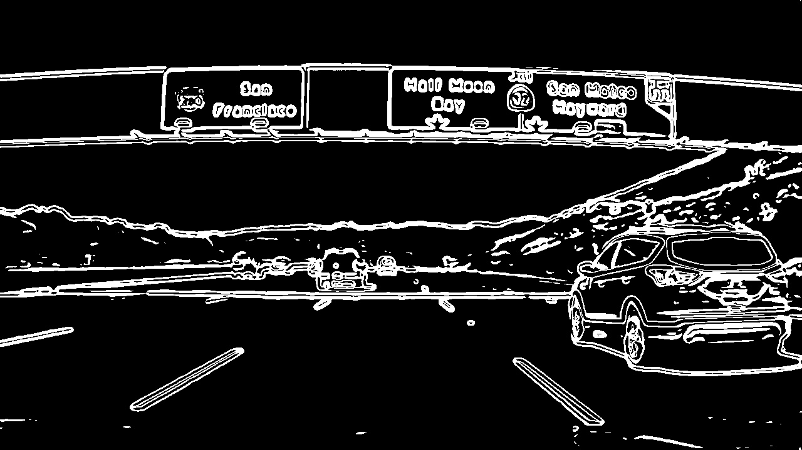

# Advanced Techniques for Lane Finding

## Sobel Operator

The Sobel operator is at the heart of the Canny edge detection algorithm. Applying the Sobel operator to an image is a way of taking the derivative of the image in the $x$ or $y$ direction. The operators for $Sobel_x$ and $Sobel_y$, respectively, lool like this:


These are examples of Sobel operators with a kernel size of 3 (implying a 3 x 3 operator in each case). This is the minimum size, but the kernel size can be any odd number. A larger kernel implies taking the gradient over a larger region of the image, or, in other words, a smoother gradient.

To understand how these operators take the derivative, you can think of overlaying either one on a 3 x 3 region of an image. If the image is flat across that region (i.e., there is little change in values across the given region), then the result (summing the element-wise product of the operator and corresponding image pixels) will be zero.

### Visual Example
If we apply the Sobel $x$ and $y$ operators to this image:


And then we take the absolute value, we get the result:


#### $x$ vs. $y$
In the above images, you can see that the gradients taken in both the $x$ and the $y$ directions detect the lane lines and pick up other edges. Taking the gradient in the $x$ direction emphasizes edges closer to vertical. Alternatively, taking the gradient in the $y$ direction emphasizes edges closer to horizontal.

In the upcoming exercises, you'll write functions to take various thresholds of the $x$ and $y$ gradients. Here's some code that might be useful:

### Result


> Pixels have a value of 1 or 0 based on the strenth of the $x$ gradient.

---

## Magnitude of the Gradient



The goal is to apply a threshold to the overall magnitude of the gradient, in both x and y.

The magnitude, or absolute value, of the gradient is just the square root of the squares of the individual x and y gradients. For a gradient in both the $x$ and $y$ directions, the magnitude is the square root of the sum of the squares.

$$\text{abs_sobelx} = \sqrt{(sobel_x)^2}$$

$$\text{abs_sobely} = \sqrt{(sobel_y)^2}$$

$$\text{abs_sobelxy} = \sqrt{(sobel_x)^2+(sobel_y)^2}$$

It's also worth considering the size of the region in the image over which you'll be taking the gradient. You can modify the kernel size for the Sobel operator to change the size of this region. Taking the gradient over larger regions can smooth over noisy intensity fluctuations on small scales. The default Sobel kernel size is 3, but here you'll define a new function that takes kernel size as a parameter.

It's important to note here that the kernel size should be an **odd** number. Since we are searching for the gradient around a given pixel, we want to have an equal number of pixels in each direction of the region from this central pixel, leading to an odd-numbered filter size - a filter of size three has the central pixel with one additional pixel in each direction, while a filter of size five has an additional two pixels outward from the central pixel in each direction.

The function you'll define for the exercise below should take in an image and optional Sobel kernel size, as well as thresholds for gradient magnitude. Next, you'll compute the gradient magnitude, apply a threshold, and create a binary output image showing where thresholds were met.

---

## Direction of the Gradient

Gradient magnitude is at the heart of Canny edge detection, and is why Canny works well for picking up all edges.

In the case of lane lines, we're interested only in edges of a particular orientation. So now we will explore the direction, or orientation, of the gradient.

The direction of the gradient is simply the inverse tangent (arctangent) of the $y$ gradient divided by the $x$ gradient:

$$arctan(sobel_y/sobel_x)$$

Each pixel of the resulting image contains a value for the angle of the gradient away from horizontal in units of radians, covering a range of $−π/2$ to $π/2$. An orientation of 0 implies a vertical line and orientations of $+/−π/2$ imply horizontal lines. (Note that in the quiz below, we actually utilize np.arctan2, which can return values between $+/−π$; however, as we'll take the absolute value of $sobel_x$, this restricts the values to $+/−π/2$, as shown [here](https://en.wikipedia.org/wiki/Atan2).)

---

## Combining Threshold

### Process


### Original Image vs Result Image


---

## HLS Color Threshold

A **color space** is a specific organization of colors; color spaces provide a way to categorize colors and represent them in digital images.

**RGB** is red-green-blue color space. You can think of this as a 3D space, in this case a cube, where any color can be represented by a 3D coordinate of R, G, and B values. For example, white has the coordinate (255, 255, 255), which has the maximum value for red, green, and blue.

**Note**: If you read in an image using `matplotlib.image.imread()` you will get an RGB image, but if you read it in using OpenCV `cv2.imread()` this will give you a BGR image.


There are many other ways to represent the colors in an image besides just composed of red, green, and blue values.

There is also **HSV** color space (hue, saturation, and value), and **HLS** space (hue, lightness, and saturation). These are some of the most commonly used color spaces in image analysis.

To get some intuition about these color spaces, you can generally think of **Hue**as the value that represents color independent of any change in brightness. So if you imagine a basic red paint color, then add some white to it or some black to make that color lighter or darker -- the underlying color remains the same and the hue for all of these colors will be the same. 

On the other hand, **Lightness** and **Value** represent different ways to measure the relative lightness or darkness of a color. For example, a dark red will have a similar hue but much lower value for lightness than a light red. **Saturation**also plays a part in this; saturation is a measurement of colorfulness. So, as colors get lighter and closer to white, they have a lower saturation value, whereas colors that are the most intense, like a bright primary color (imagine a bright red, blue, or yellow), have a high saturation value. You can get a better idea of these values by looking at the 3D color spaces pictured below.

Most of these different color spaces were either inspired by the human vision system, and/or developed for efficient use in television screen displays and computer graphics. You can read more about the history and the derivation of HLS and HSV color spaces [here](https://en.wikipedia.org/wiki/HSL_and_HSV).


**Constants**

$$V_{\text{max}}←max(\text{R,G,B})$$

$$V_{\text{min}}←max(\text{R,G,B})$$

These are the maximum and minimum values across all three RGB values for a given color (by pixel).

Note that in these equations, it would be necessary to divide the RGB values by 255 such that they fall in the range (0,1)(0,1), but OpenCV will perform this for you in `cv2.cvtColor()`. **L** and **S** are scaled back up after the transformations take place, while **H** is halved for use in 8-bit images (see below).

### HLS and Color Thresholds


Here we'll explore this a bit further and look at a couple examples to see why a color space like HLS can be more robust. Let's first take another look at some of the images you saw in the last video.

Here I'll read in the same original image (the image above), convert to grayscale, and apply a threshold that identifies the lines:

```python
import numpy as np
import cv2
import matplotlib.pyplot as plt
import matplotlib.image as mpimg

image = mpimg.imread('test6.jpg')
thresh = (180, 255)
gray = cv2.cvtColor(image, cv2.COLOR_RGB2GRAY)
binary = np.zeros_like(gray)
binary[(gray > thresh[0]) & (gray <= thresh[1])] = 1
```

And here's the result:


You might have also explored thresholding individual RGB color channels. You can take a look at them side by side to see which ones do a better job of picking up the lane lines:

```python
R = image[:,:,0]
G = image[:,:,1]
B = image[:,:,2]
```


The R channel does a reasonable job of highlighting the lines, and you can apply a similar threshold to find lane-line pixels:

```python
thresh = (200, 255)
binary = np.zeros_like(R)
binary[(R > thresh[0]) & (R <= thresh[1])] = 1
```


We're looking at different color spaces. While there are several that are worth exploring, here we'll look specifically at HLS. When we separate the H, L, and S channels we get the following result: 

```python
hls = cv2.cvtColor(image, cv2.COLOR_RGB2HLS)
H = hls[:,:,0]
L = hls[:,:,1]
S = hls[:,:,2]
```


The S channel picks up the lines well, so let's try applying a threshold there:

```python
thresh = (90, 255)
binary = np.zeros_like(S)
binary[(S > thresh[0]) & (S <= thresh[1])] = 1
```


You can also see that in the H channel, the lane lines appear dark, so we could try a low threshold there and obtain the following result:

```python
thresh = (15, 100)
binary = np.zeros_like(H)
binary[(H > thresh[0]) & (H <= thresh[1])] = 1
```


From these examples, you can see that the S channel is probably your best bet. It's cleaner than the H channel result and a bit better than the R channel or simple grayscaling. But it's not clear that one method is far superior to the others. 

In each case, I've tweaked the threshold parameters to do as good a job as possible of picking out the lines. Where we can really see a difference in results, however, is when we step to a new frame, where there are shadows and different colors in the pavement. 

Look at the same thresholds applied to each of these four channels for this image:


Here's how the various channels and binaries (with the same threshold values as above) look: 


The S channel is still doing a fairly robust job of picking up the lines under very different color and contrast conditions, while the other selections look messy. You could tweak the thresholds and get closer in the other channels, but the S channel is preferable because it is more robust to changing conditions.

It's worth noting, however, that the R channel still does rather well on the white lines, perhaps even better than the S channel. As with gradients, it's worth considering how you might combine various color thresholds to make the most robust identification of the lines.